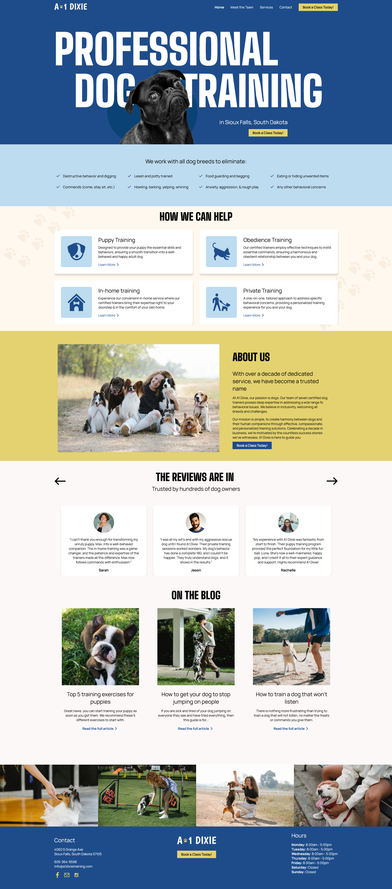
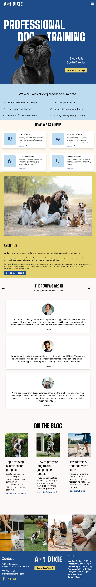
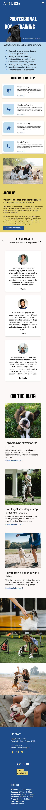

---

I found this design in Figma Community and try to copy this design in HTML, CSS and JavaScript

\*\*here is the link:

https://www.figma.com/design/zA7wCD4NJ08ETUxqFyn2Qo/Design-your-first-website-on-Figma-(Community)?node-id=0-1&node-type=canvas&t=SkUATIVQH93qLKaz-0

---

# Pet Website

## Live Preview

[Live Preview](https://loquacious-kheer-5039a1.netlify.app)

## Description

This project is a **pet website** that I built using **HTML**, **CSS**, and **JavaScript**. It showcases my skills in frontend development and was inspired by [mention inspiration source or leave generic, e.g., "various pet-related websites"] to create a fun and user-friendly interface for pet lovers.

## Features

- **Beautiful Design**: Aesthetic and responsive design to make browsing enjoyable on all devices.
- **Interactive Elements**: Engaging animations and interactive features implemented using JavaScript.
- **Informative Sections**: Dedicated areas for pet profiles, tips, and resources.

## Technologies Used

- **HTML5** for the structure.
- **CSS3** for styling and layout, including animations.
- **JavaScript** for dynamic functionality and interactivity.

## Inspiration

This project was inspired by ["Flux Academy/https://www.youtube.com/watch?v=Y0Mw3lscVWM&t=149s"].

---

## Screenshots

### Home Page

